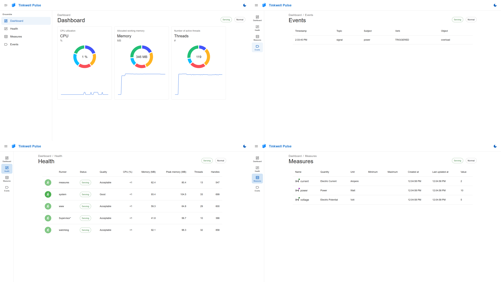

# Tinkwell Pulse

Web application to monitor a [Tinkwell](https://github.com/arepetti/Tinkwell) installation.

This is both an example about interfacing a web application with Tinkwell and an usable dashboard to monitor and debug an installation.

## Overview



## Important Security Notice

First of all the most important thing of them all: **do not expose Tinkwell services to the open Internet**. If you're building a web application to manage your production system remotely then you must expose an adequately protected API.

In other words: this web application interfaces directly with Tinkwell services, do not expose it!

## How To Install Tinkwell Pulse

Assuming that Tinkwell is properly installed and configured:

* Download the release you want to use (or clone this repository and compile locally with `npm run build`).
* Edit the Ensamble Configuration file (usually `ensamble.tw`) in Tinkwell to include:
    ```text
    runner www "Tinkwell.Bootstrapper.WebHost" {
        properties {
            root_path: "/path/to/tinkwell-pulse"
            port_number: "4999"
        }
    }
    ```
* Start Tinkwell.
* Navigate to `https://<YOUR-IP-ADDRESS>:4999` or `https://<COMPUTER-NAME>:4999`.